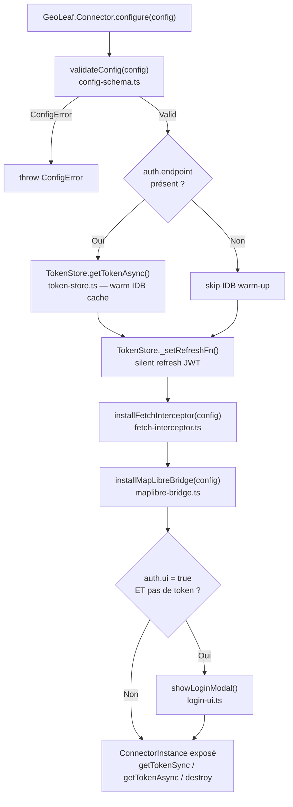

# plugin-connector — Internals (`src/`)

Documentation des modules internes du plugin `@geoleaf/connector`.  
**Ne pas importer ces modules directement** — utiliser l'API publique via `GeoLeaf.Connector` ou `createConnector()`.

---

## Modules

| Fichier                | Rôle                                                           | Exports clés                                                              |
| ---------------------- | -------------------------------------------------------------- | ------------------------------------------------------------------------- |
| `entry.ts`             | Point d'entrée — boot, singleton global, `createConnector()`   | `ConnectorInstance`, `createConnector()`, `GeoLeaf.Connector.configure()` |
| `config-schema.ts`     | Types + validation de `ConnectorConfig`                        | `ConnectorConfig`, `ConfigError`, `validateConfig()`                      |
| `auth-client.ts`       | Appels HTTP vers l'endpoint d'authentification                 | `AuthClient`, `AuthError`                                                 |
| `token-store.ts`       | Persistance IndexedDB + cache RAM + silent refresh JWT         | `TokenStore`, `TokenRecord`                                               |
| `fetch-interceptor.ts` | Monkey-patch `window.fetch` — injection header `Authorization` | `install()`, `uninstall()`, `getWorkerHeaders()`                          |
| `maplibre-bridge.ts`   | `map.setTransformRequest()` pour tuiles MVT/PMTiles            | `installMapLibreBridge()`                                                 |
| `format-detector.ts`   | Détection du format de données depuis une URL                  | `detectFormat()`, `DataFormat`                                            |
| `login-ui.ts`          | Modal de connexion accessible (CSS inliné, zéro dépendance)    | `showLoginModal()`                                                        |

---

## Flux de données — `configure()`



---

## Modèle de données

### `ConnectorConfig` (`config-schema.ts`)

```ts
interface ConnectorConfig {
    baseUrl: string; // Préfixe URL — toutes les req. matchant ce préfixe reçoivent le token
    getToken?: () => string | null | Promise<string | null>; // Mode callback (exclusif avec auth)
    auth?: {
        endpoint: string; // URL du serveur d'auth (POST credentials → JWT)
        ui?: boolean; // Afficher le modal de connexion si pas de token
        credentials?: {
            // Optionnel — pré-rempli dans le modal
            username?: string;
            password?: string;
        };
    };
}
```

Les deux modes `getToken` et `auth` sont **mutuellement exclusifs** — `validateConfig()` lève une `ConfigError` si les deux sont fournis.

### `ConnectorInstance` (`entry.ts`)

```ts
interface ConnectorInstance {
    getTokenSync(): string | null; // RAM cache seulement (sync — non bloquant)
    getTokenAsync(): Promise<string | null>; // IDB → RAM cache (async, refresh si expiré)
    destroy(): void; // Restaure window.fetch, vide le cache RAM
}
```

### `TokenRecord` (`token-store.ts`)

```ts
interface TokenRecord {
    baseUrl: string; // Clé primaire IDB
    token: string; // JWT
    expiresAt: number; // Timestamp ms
}
```

### `DataFormat` (`format-detector.ts`)

```ts
type DataFormat = "geojson" | "flatgeobuf" | "kml" | "csv" | "pmtiles" | "oapif" | "mvt";
```

---

## Règles de routage des requêtes (`fetch-interceptor.ts`)

| Format détecté                                 | Chemin d'injection                                   |
| ---------------------------------------------- | ---------------------------------------------------- |
| `geojson`, `flatgeobuf`, `kml`, `csv`, `oapif` | `window.fetch` monkey-patch                          |
| `mvt`, `pmtiles`                               | `map.setTransformRequest()` via `maplibre-bridge.ts` |

La séparation est nécessaire car MapLibre gère ses propres requêtes de tuiles en interne et n'utilise pas `window.fetch`.

---

## MapLibre Bridge — stratégie de résolution (`maplibre-bridge.ts`)

Le bridge s'installe en 3 temps pour couvrir tous les cas :

1. **Immédiat** — si `GeoLeaf.Core.getMap()` est disponible au moment de `configure()`
2. **Différé** — via listener `geoleaf:map:ready` si la carte n'est pas encore initialisée
3. **Défensif** — re-install sur `geoleaf:basemap:change` après un `map.setStyle()`

L'accès à la carte est fait via `globalThis.GeoLeaf.Core.getMap().getNativeMap()` — **aucun import de `@geoleaf/core`** (règle `no-premium-in-core` en sens inverse).

---

## Dépendances internes

```
entry.ts
├── config-schema.ts
├── token-store.ts
├── fetch-interceptor.ts
│   ├── config-schema.ts
│   ├── token-store.ts
│   └── format-detector.ts
├── maplibre-bridge.ts
│   ├── config-schema.ts
│   └── token-store.ts
├── auth-client.ts
└── login-ui.ts
    ├── config-schema.ts
    ├── token-store.ts
    └── auth-client.ts
```

`format-detector.ts` — zéro dépendance interne (fonction pure).  
`auth-client.ts` — zéro dépendance interne (HTTP pur).
